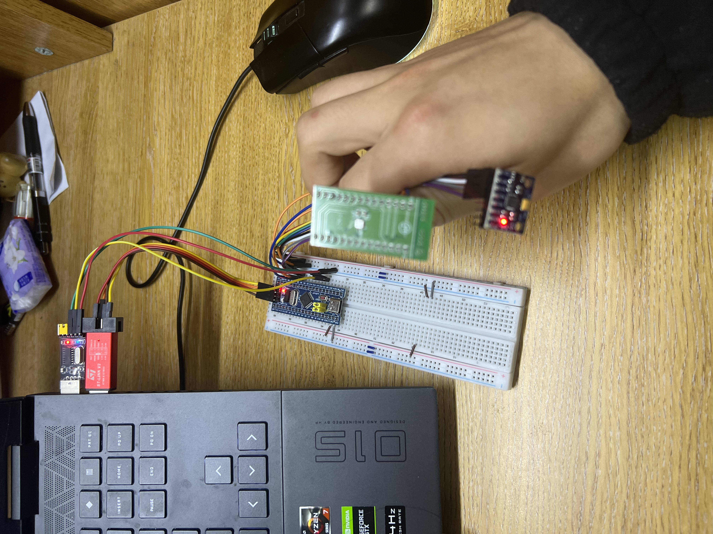
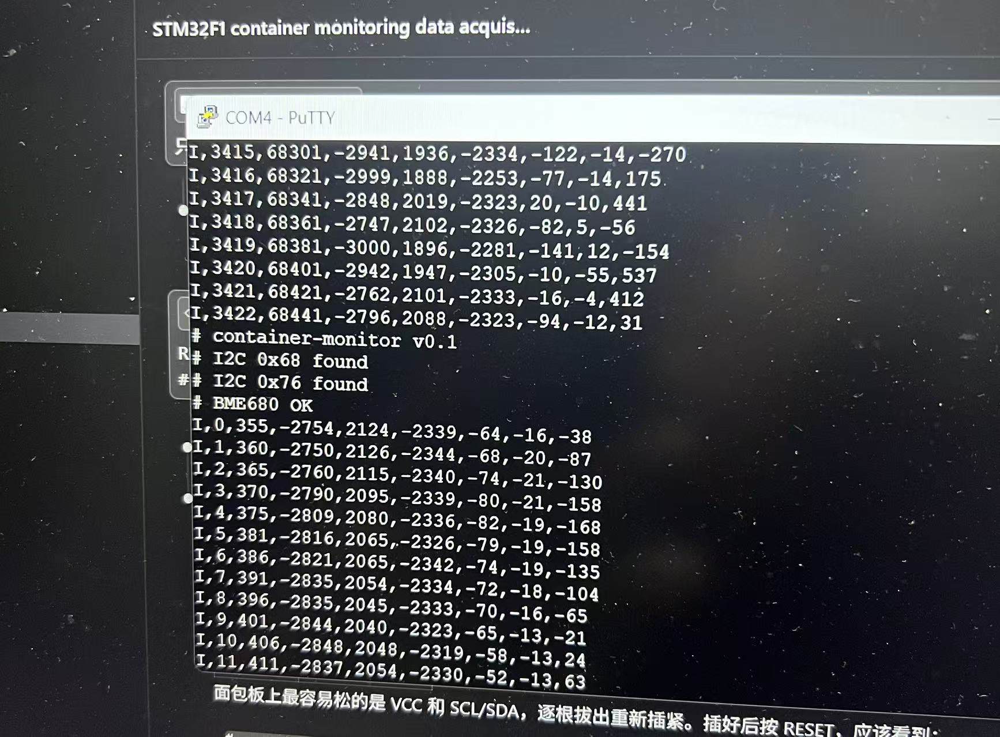

# 面向集装箱状态监控的异构数据采集与边缘融合平台

基于 STM32F103C8 + MPU6050 + BME680 的嵌入式数据采集系统，以 50Hz 采集六轴振动数据、每 15 分钟采集一次温湿度环境数据，持续写入带时间戳的 CSV 文件，用于机器学习模型训练数据集的构建。

**作者：Dayday_up**  📧 wb258770106@163.com

---

## 目录

- [效果展示](#效果展示)
- [硬件清单](#硬件清单)
- [系统架构](#系统架构)
- [硬件连接](#硬件连接)
- [软件环境](#软件环境)
- [第一步：CubeMX 配置](#第一步cubemx-配置)
- [第二步：固件开发](#第二步固件开发)
- [第三步：上位机采集](#第三步上位机采集)
- [数据格式说明](#数据格式说明)
- [项目文件结构](#项目文件结构)
- [常见问题](#常见问题)

---

## 效果展示

### 硬件连接



### 串口数据实时输出



> 上图为 VOFA+ 串口助手实时接收到的数据，`I,` 行为 50Hz IMU 数据，`E,` 行为 15 分钟一次的 BME680 环境数据。

---

## 硬件清单

| 名称 | 型号 / 规格 | 数量 |
|---|---|---|
| 主控板 | STM32F103C8T6 最小系统板 | 1 |
| 烧录器 | ST-Link V2 | 1 |
| IMU 传感器 | MPU6050 模块 | 1 |
| 环境传感器 | BME680 模块 | 1 |
| 串口转换器 | USB-TTL（CH340/CP2102） | 1 |
| 面包板 + 杜邦线 | 若干 | — |

---

## 系统架构

```
┌─────────────────────────────┐
│        STM32F103C8          │
│                             │
│  I2C1 ──── MPU6050 (0x68)  │  六轴加速度/陀螺仪  50Hz
│        └── BME680  (0x76)  │  温湿度/气压/气体  15min
│                             │
│  USART1 ──► USB-TTL ──► PC │  ASCII CSV 串口协议
│                             │
│  TIM2 (50Hz 硬件定时中断)   │  采样节拍控制
└─────────────────────────────┘
          │
          ▼ collector.py
    imu_<ts>.csv  +  env_<ts>.csv
```

---

## 硬件连接

### ST-Link → STM32F1（烧录/调试）

| ST-Link | STM32F1 |
|---|---|
| SWDIO | PA13 |
| SWCLK | PA14 |
| GND | GND |
| 3.3V | 3V3 |

### USB-TTL → STM32F1（串口数据）

| USB-TTL | STM32F1 |
|---|---|
| RX | PA9 |
| GND | GND |

> 只需接 RX 和 GND，不需要 TX。

### MPU6050 → STM32F1

| MPU6050 | STM32F1 |
|---|---|
| VCC | 3V3 |
| GND | GND |
| SCL | PB6 |
| SDA | PB7 |
| AD0 | 不接（默认 GND，I2C 地址 0x68）|

### BME680 → STM32F1

| BME680 | STM32F1 |
|---|---|
| VCC | 3V3 |
| GND | GND |
| SCL | PB6（与 MPU6050 共用） |
| SDA | PB7（与 MPU6050 共用） |
| CS | **3V3**（必须接高电平，选择 I2C 模式）|
| SDO/ADDR | GND（I2C 地址 0x76）|

> **注意：** MPU6050 模块板上带有 I2C 上拉电阻（4.7kΩ），两个传感器必须同时接线，否则 I2C 总线无上拉会导致通信失败。

---

## 软件环境

### 固件开发环境

| 工具 | 版本 | 用途 |
|---|---|---|
| STM32CubeIDE | 2.x | 固件编译、烧录、调试 |
| STM32CubeMX | 独立版 6.x | 外设图形化配置、代码生成 |
| Bosch bme68x API | v4.4.8 | BME680 官方驱动 |

### 上位机环境

```bash
Python >= 3.8
pyserial >= 3.5
```

---

## 第一步：CubeMX 配置

### 1.1 创建工程

打开 STM32CubeMX → New Project → 搜索 `STM32F103C8Tx` → 选中 → 填写项目名称和路径 → Finish。

弹出"Initialize all peripherals with their default Mode?"选 **No**。

### 1.2 配置 SYS（调试接口）

左侧 **System Core → SYS**：
- **Debug** → `Serial Wire`

> 必须配置，否则第一次烧录后 ST-Link 无法再次连接。

### 1.3 配置 RCC（时钟源）

左侧 **System Core → RCC**：
- **High Speed Clock (HSE)** → `Crystal/Ceramic Resonator`

### 1.4 配置时钟树

点击顶部 **Clock Configuration** 标签页：

- Input frequency：`8`
- PLL Source Mux：`HSE`
- PLLMul：`×9`
- System Clock Mux：`PLLCLK`
- 确认 HCLK = **72 MHz**

### 1.5 配置 I2C1

左侧 **Connectivity → I2C1**：
- Mode：`I2C`
- Clock Speed：`100000`（100kHz Standard Mode）

引脚自动分配：PB6 = SCL，PB7 = SDA。

### 1.6 配置 USART1

左侧 **Connectivity → USART1**：
- Mode：`Asynchronous`
- Baud Rate：`115200`，8N1

### 1.7 配置 TIM2（50Hz 采样定时器）

左侧 **Timers → TIM2**：
- Clock Source：`Internal Clock`
- Prescaler：`7199`
- Counter Period：`199`

> 计算：72MHz ÷ (7199+1) ÷ (199+1) = **50Hz** 精确

切换到 **NVIC Settings** 子标签：
- **TIM2 global interrupt** → 勾选 Enabled

### 1.8 生成代码

**Project → Generate Code** → 在 CubeIDE 中打开生成的工程 → **Ctrl+B** 编译，确认 `0 errors, 0 warnings`。

### 1.9 开启浮点 printf 支持

CubeIDE 菜单 **Project → Properties → C/C++ Build → Settings → MCU GCC Linker → Miscellaneous**：

在 **Other flags** 中添加：
```
-u _printf_float
```

---

## 第二步：固件开发

### 2.1 添加 Bosch BME68x 驱动文件

从 [Bosch bme68x SensorAPI](https://github.com/boschsensortec/BME68x_SensorAPI) 下载以下三个文件：

- `bme68x.c` → 放入 `Core/Src/`
- `bme68x.h` → 放入 `Core/Inc/`
- `bme68x_defs.h` → 放入 `Core/Inc/`

### 2.2 编写 MPU6050 驱动

新建 `Core/Inc/mpu6050.h` 和 `Core/Src/mpu6050.c`：

**mpu6050.h**
```c
#ifndef __MPU6050_H__
#define __MPU6050_H__
#include "i2c.h"

HAL_StatusTypeDef MPU6050_Init(void);
HAL_StatusTypeDef MPU6050_Read(int16_t *ax, int16_t *ay, int16_t *az,
                               int16_t *gx, int16_t *gy, int16_t *gz);
#endif
```

**mpu6050.c**
```c
#include "mpu6050.h"

#define MPU_ADDR       (0x68 << 1)
#define REG_PWR_MGMT_1 0x6B
#define REG_CONFIG     0x1A
#define REG_GYRO_CFG   0x1B
#define REG_ACCEL_CFG  0x1C
#define REG_ACCEL_XOUT 0x3B

static HAL_StatusTypeDef mpu_write(uint8_t reg, uint8_t val)
{
    uint8_t buf[2] = {reg, val};
    return HAL_I2C_Master_Transmit(&hi2c1, MPU_ADDR, buf, 2, 10);
}

HAL_StatusTypeDef MPU6050_Init(void)
{
    HAL_StatusTypeDef s;
    s = mpu_write(REG_PWR_MGMT_1, 0x00); if (s != HAL_OK) return s;
    HAL_Delay(10);
    s = mpu_write(REG_CONFIG,    0x04); if (s != HAL_OK) return s; /* DLPF ~21Hz */
    s = mpu_write(REG_GYRO_CFG,  0x18); if (s != HAL_OK) return s; /* ±2000°/s */
    s = mpu_write(REG_ACCEL_CFG, 0x10);                             /* ±8g */
    return s;
}

HAL_StatusTypeDef MPU6050_Read(int16_t *ax, int16_t *ay, int16_t *az,
                               int16_t *gx, int16_t *gy, int16_t *gz)
{
    uint8_t buf[14];
    HAL_StatusTypeDef s = HAL_I2C_Mem_Read(&hi2c1, MPU_ADDR, REG_ACCEL_XOUT,
                                            I2C_MEMADD_SIZE_8BIT, buf, 14, 20);
    if (s != HAL_OK) return s;
    *ax = (int16_t)((buf[0]  << 8) | buf[1]);
    *ay = (int16_t)((buf[2]  << 8) | buf[3]);
    *az = (int16_t)((buf[4]  << 8) | buf[5]);
    *gx = (int16_t)((buf[8]  << 8) | buf[9]);
    *gy = (int16_t)((buf[10] << 8) | buf[11]);
    *gz = (int16_t)((buf[12] << 8) | buf[13]);
    return HAL_OK;
}
```

### 2.3 编写 BME680 HAL 接口层

新建 `Core/Inc/bme680_hal.h` 和 `Core/Src/bme680_hal.c`：

**bme680_hal.h**
```c
#ifndef __BME680_HAL_H__
#define __BME680_HAL_H__
#include "bme68x.h"
#include "i2c.h"

typedef struct {
    float    temperature;    /* °C  */
    float    humidity;       /* %RH */
    float    pressure;       /* hPa */
    uint32_t gas_resistance; /* Ω   */
} BME680_Result;

HAL_StatusTypeDef BME680_Init(void);
HAL_StatusTypeDef BME680_ReadForced(BME680_Result *out);
#endif
```

**bme680_hal.c**
```c
#include "bme680_hal.h"

static struct bme68x_dev       dev;
static struct bme68x_conf      conf;
static struct bme68x_heatr_conf heatr;
static uint8_t dev_addr = BME68X_I2C_ADDR_LOW; /* SDO=GND → 0x76 */

static int8_t bme_read(uint8_t reg, uint8_t *data, uint32_t len, void *ptr)
{
    uint8_t addr = *(uint8_t *)ptr;
    return (HAL_I2C_Mem_Read(&hi2c1, (uint16_t)(addr << 1), reg,
            I2C_MEMADD_SIZE_8BIT, data, (uint16_t)len, 100) == HAL_OK)
            ? BME68X_OK : BME68X_E_COM_FAIL;
}

static int8_t bme_write(uint8_t reg, const uint8_t *data, uint32_t len, void *ptr)
{
    uint8_t addr = *(uint8_t *)ptr;
    return (HAL_I2C_Mem_Write(&hi2c1, (uint16_t)(addr << 1), reg,
            I2C_MEMADD_SIZE_8BIT, (uint8_t *)data, (uint16_t)len, 100) == HAL_OK)
            ? BME68X_OK : BME68X_E_COM_FAIL;
}

static void bme_delay_us(uint32_t us, void *ptr)
{
    (void)ptr;
    HAL_Delay((us + 999U) / 1000U);
}

HAL_StatusTypeDef BME680_Init(void)
{
    dev.intf = BME68X_I2C_INTF;
    dev.read = bme_read; dev.write = bme_write;
    dev.delay_us = bme_delay_us; dev.intf_ptr = &dev_addr;
    if (bme68x_init(&dev) != BME68X_OK) return HAL_ERROR;

    conf.filter = BME68X_FILTER_OFF; conf.odr = BME68X_ODR_NONE;
    conf.os_hum = BME68X_OS_1X; conf.os_pres = BME68X_OS_4X;
    conf.os_temp = BME68X_OS_2X;
    if (bme68x_set_conf(&conf, &dev) != BME68X_OK) return HAL_ERROR;

    heatr.enable = BME68X_ENABLE;
    heatr.heatr_temp = 300; heatr.heatr_dur = 100;
    return (bme68x_set_heatr_conf(BME68X_FORCED_MODE, &heatr, &dev) == BME68X_OK)
           ? HAL_OK : HAL_ERROR;
}

HAL_StatusTypeDef BME680_ReadForced(BME680_Result *out)
{
    if (bme68x_set_op_mode(BME68X_FORCED_MODE, &dev) != BME68X_OK) return HAL_ERROR;
    uint32_t del_us = bme68x_get_meas_dur(BME68X_FORCED_MODE, &conf, &dev)
                    + (uint32_t)heatr.heatr_dur * 1000U;
    bme_delay_us(del_us, NULL);
    struct bme68x_data data; uint8_t n = 0;
    if (bme68x_get_data(BME68X_FORCED_MODE, &data, &n, &dev) != BME68X_OK || n == 0)
        return HAL_ERROR;
    out->temperature    = data.temperature;
    out->humidity       = data.humidity;
    out->pressure       = data.pressure / 100.0f;
    out->gas_resistance = data.gas_resistance;
    return HAL_OK;
}
```

### 2.4 修改 main.c

在 `main.c` 的对应 USER CODE 区域添加以下内容：

**USER CODE BEGIN Includes**
```c
#include <stdio.h>
#include <string.h>
#include "mpu6050.h"
#include "bme680_hal.h"
```

**USER CODE BEGIN PV**
```c
static uint32_t imu_seq    = 0;
static uint32_t env_seq    = 0;
static uint32_t tick_count = 0;
static uint8_t  bme680_ready = 0;
volatile uint8_t imu_flag  = 0;   /* TIM2 中断置 1，主循环清零 */
#define ENV_TICKS 45000U           /* 50Hz × 60s × 15min */
```

**USER CODE BEGIN 2**
```c
HAL_Delay(300);
HAL_UART_Transmit(&huart1, (uint8_t *)"# container-monitor v0.1\r\n", 27, 100);

if (MPU6050_Init() != HAL_OK) {
    HAL_UART_Transmit(&huart1, (uint8_t *)"# MPU6050 FAILED\r\n", 18, 100);
    Error_Handler();
}
if (BME680_Init() == HAL_OK) {
    bme680_ready = 1;
} else {
    HAL_UART_Transmit(&huart1, (uint8_t *)"# BME680 FAILED\r\n", 17, 100);
}
HAL_TIM_Base_Start_IT(&htim2);
```

**USER CODE BEGIN 3**（主循环内）
```c
if (imu_flag) {
    imu_flag = 0;

    int16_t ax, ay, az, gx, gy, gz;
    if (MPU6050_Read(&ax, &ay, &az, &gx, &gy, &gz) != HAL_OK) continue;

    char buf[64];
    int len = snprintf(buf, sizeof(buf), "I,%u,%u,%d,%d,%d,%d,%d,%d\r\n",
                       (unsigned)imu_seq++, (unsigned)HAL_GetTick(),
                       ax, ay, az, gx, gy, gz);
    HAL_UART_Transmit(&huart1, (uint8_t *)buf, (uint16_t)len, 20);

    if (++tick_count >= ENV_TICKS) {
        tick_count = 0;
        if (bme680_ready) {
            BME680_Result env;
            if (BME680_ReadForced(&env) == HAL_OK) {
                char ebuf[80];
                int elen = snprintf(ebuf, sizeof(ebuf),
                                    "E,%u,%u,%.2f,%.2f,%.2f,%u\r\n",
                                    (unsigned)env_seq++, (unsigned)HAL_GetTick(),
                                    (double)env.temperature, (double)env.humidity,
                                    (double)env.pressure, (unsigned)env.gas_resistance);
                HAL_UART_Transmit(&huart1, (uint8_t *)ebuf, (uint16_t)elen, 50);
            }
        }
    }
}
```

### 2.5 修改 stm32f1xx_it.c

在 `TIM2_IRQHandler` 的 USER CODE BEGIN 区域添加：

**USER CODE BEGIN EV**（外部变量声明）
```c
extern volatile uint8_t imu_flag;
```

**USER CODE BEGIN TIM2_IRQn 0**
```c
imu_flag = 1;
```

### 2.6 编译烧录

**Ctrl+B** 编译，确认 0 errors → **Run → Run** 烧录。

---

## 第三步：上位机采集

### 3.1 安装依赖

```bash
cd container-monitor
python -m venv .venv

# Windows
.venv\Scripts\activate

pip install pyserial
```

### 3.2 开始采集

```bash
# 默认 COM3，115200
python host/collector.py

# 指定串口
python host/collector.py COM4

# 指定串口和波特率
python host/collector.py COM4 115200
```

启动后会在 `data/` 目录下自动创建：
- `imu_<时间戳>.csv`：IMU 数据，50Hz
- `env_<时间戳>.csv`：环境数据，15分钟一次

按 **Ctrl+C** 停止采集。

### 3.3 虚拟 MCU 测试（无硬件也可运行）

不需要硬件，使用虚拟串口对（Windows 推荐 com0com）模拟 MCU 输出：

```bash
# 终端 A：模拟 MCU 发数据（COM10）
python host/fake_mcu.py COM10

# 终端 B：采集数据（COM11）
python host/collector.py COM11
```

---

## 数据格式说明

### 串口协议

两种数据行通过首字符区分，collector.py 自动分流：

```
I,<seq>,<mcu_ms>,<ax>,<ay>,<az>,<gx>,<gy>,<gz>
E,<seq>,<mcu_ms>,<temp_c>,<humidity>,<pressure>,<gas_ohm>
```

以 `#` 开头的行为调试注释，collector.py 自动忽略。

### imu_\<ts\>.csv

| 字段 | 类型 | 说明 |
|---|---|---|
| pc_ts | datetime | PC 墙钟时间戳 |
| seq | int | 序号，用于检测丢包 |
| mcu_ms | int | MCU 时间戳（ms），`HAL_GetTick()` |
| ax / ay / az | int16 | 加速度计原始值（±8g，1g≈4096 LSB） |
| gx / gy / gz | int16 | 陀螺仪原始值（±2000°/s） |

采样率：**50Hz**（由 TIM2 硬件定时器中断驱动）

### env_\<ts\>.csv

| 字段 | 类型 | 说明 |
|---|---|---|
| pc_ts | datetime | PC 墙钟时间戳 |
| seq | int | 序号 |
| mcu_ms | int | MCU 时间戳（ms） |
| temp_c | float | 温度（°C） |
| humidity | float | 相对湿度（%RH） |
| pressure | float | 气压（hPa） |
| gas_ohm | int | 气体电阻（Ω），反映空气质量 |

采样间隔：**15 分钟**（Forced Mode，含 100ms 加热）

---

## 项目文件结构

```
container-monitor/
├── firmware/
│   └── container-monitor-fw/       # STM32CubeIDE 工程
│       ├── Core/
│       │   ├── Inc/
│       │   │   ├── main.h
│       │   │   ├── mpu6050.h
│       │   │   ├── bme680_hal.h
│       │   │   ├── bme68x.h
│       │   │   └── bme68x_defs.h
│       │   └── Src/
│       │       ├── main.c          # 主逻辑、采集循环
│       │       ├── mpu6050.c       # MPU6050 I2C 驱动
│       │       ├── bme680_hal.c    # BME680 HAL 接口层
│       │       ├── bme68x.c        # Bosch 官方驱动
│       │       └── stm32f1xx_it.c  # TIM2 中断处理
│       └── container-monitor-fw.ioc
├── host/
│   ├── collector.py    # 串口 → CSV 采集脚本
│   └── fake_mcu.py     # 虚拟 MCU（无硬件测试用）
├── data/               # 采集输出目录（自动创建）
└── README.md
```

---

## 常见问题

**Q：ST-Link 连不上，报 "Target no device found"**

每次接 BME680 线后出现，大概率是杜邦线碰到了 SWD 引脚（PA13/PA14）附近导致串扰。排查方法：把除 ST-Link 4 根线（SWDIO/SWCLK/GND/3V3）之外的所有线拔掉，确认能连上后再逐根接回去。

**Q：BME680 报初始化失败**

按顺序检查：① CS 引脚是否接到 3V3（不能悬空）；② MPU6050 是否同时在线（I2C 上拉电阻依赖 MPU6050 模块）；③ SDO 引脚接线是否正确（接 GND = 0x76，接 3V3 = 0x77）。

**Q：env CSV 中温湿度气压字段为空**

newlib-nano 默认裁剪了浮点 `printf`。在 CubeIDE 的 **Project → Properties → C/C++ Build → Settings → MCU GCC Linker → Miscellaneous → Other flags** 中添加 `-u _printf_float`，重新编译烧录。

**Q：VOFA+ 串口助手显示空白**

两个可能：① COM 口被 CubeIDE 的调试进程占用，在任务管理器结束 `ST-LINK_GDB_server.exe` 后重连；② USB-TTL 的 RX 引脚未接到 STM32F1 的 PA9。可以用 PowerShell 或 Putty 交叉验证数据是否到达 PC。

**Q：IMU 数据的 az 不在 4096 左右**

传感器未水平放置，重力会分散到三个轴。静止时验证方法：计算 `sqrt(ax²+ay²+az²)` 的值，结果应约等于 4096（1g），误差 ±200 以内为正常。

**Q：gas_ohm 值很低（<50kΩ）**

BME680 气体传感器需要累积多次加热循环才能稳定，初次上电后的前几十次读数偏低是正常现象。长时间采集后数值会趋于稳定，室内清洁空气通常在 50k~300kΩ 范围内。

---

## License

MIT
